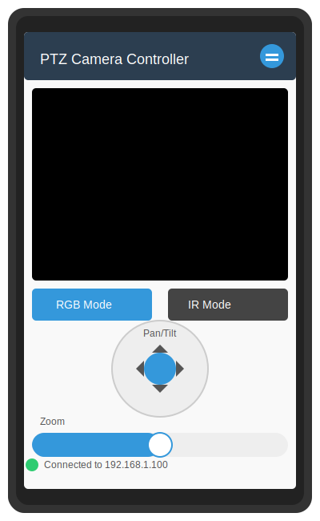

# PTZ Camera Controller

A comprehensive Android application for controlling PTZ (Pan-Tilt-Zoom) cameras through an onboard computer such as a Raspberry Pi or NVIDIA Jetson.



## Documentation

Comprehensive documentation is available for this project:

- [Documentation Index](docs/index.md) - Complete documentation overview
- [System Architecture](docs/system_architecture.md) - Component structure and interactions
- [Communication Flow](docs/communication_flow.md) - Sequence diagrams showing data flow
- [Deployment Architecture](docs/deployment_architecture.md) - Physical deployment details
- [Development Roadmap](docs/development_roadmap.md) - Planned features and timeline
- [Android SDK Setup](docs/android_sdk_setup.md) - Detailed Android SDK configuration guide

## Development Setup

This project uses JDK 17 and Gradle for building the Android application. We provide simplified scripts for building and configuring the Android SDK.

### Android SDK Setup

The project requires Android SDK with build tools version 34.0.0 and compile SDK version 34. We provide a streamlined setup process:

1. Run `./simplified_build.sh sdk-check` to verify your SDK setup
2. Run `./simplified_build.sh generate-qr` to generate a QR code with SDK configuration details
3. Scan the QR code to get detailed setup instructions for your development environment

### Build Scripts

We provide several build scripts to simplify development:

```bash
# Verify SDK setup
./simplified_build.sh sdk-check

# Generate QR code with SDK configuration
./simplified_build.sh generate-qr

# Quick project check without running Gradle
./simplified_build.sh minimal-check

# Show project structure and tasks
./simplified_build.sh project-info

# Compile without building APK
./simplified_build.sh compile

# Build debug APK
./simplified_build.sh debug 

# Resolve dependencies
./simplified_build.sh dependencies

# Check project structure
./simplified_build.sh check-project
```

These scripts are designed to work efficiently in CI/CD environments and handle SDK location resolution automatically.

## Features

- **Dual-mode video streaming** - Support for both RGB and IR/Thermal cameras
- **Flexible connectivity** - Connect via WiFi or Bluetooth
- **Intuitive controls** - Simple pan, tilt, and zoom controls with touch interface
- **Camera mode switching** - Easily switch between RGB and IR/Thermal modes
- **Adaptive quality** - Adjust video quality based on network conditions
- **Preset positions** - Save and load camera position presets
- **Local monitoring** - Optional local video monitoring on the connected display

## Installation

### Android Tablet

#### Option 1: Install via QR Code (Recommended)

Scan this QR code with your Android tablet to download the latest APK:


This QR code will automatically update when new releases are published, always linking to the latest version.

#### Option 2: Direct Download

Download the APK directly from our [GitHub Releases page](https://github.com/zforce0/ptz-camera-controller/releases).

Each release includes:
- APK file for direct installation
- QR code image for easy sharing
- Release notes with changes and improvements
- Installation instructions

#### Installation Steps:

1. Download the APK file to your Android tablet
2. Enable installation from unknown sources in Settings > Security
3. Open the downloaded APK file to install
4. Launch the app and follow the setup instructions

#### Automatic Updates:

The app will periodically check for new releases on GitHub and notify you when updates are available.

### Onboard Computer (Raspberry Pi / Nvidia Jetson)

1. Clone this repository:
   ```
   git clone https://github.com/zforce0/ptz-camera-controller.git
   cd ptz-camera-controller
   ```

2. Install the required dependencies:
   ```
   pip install -r onboard/requirements.txt
   ```

3. Start the camera server:
   ```
   cd onboard
   python camera_server.py
   ```

4. For local monitoring (if a display is connected):
   ```
   python camera_server.py --enable-local-viewer
   ```

## Connection Guide

1. Start the server on your onboard computer
2. Launch the PTZ Camera Controller app on your tablet
3. For WiFi connection:
   - Enter the IP address of your onboard computer
   - Default port is 8000
4. For Bluetooth connection:
   - Ensure Bluetooth is enabled on both devices
   - Select "PTZCameraServer" from the list of available devices
5. Once connected, you'll see the live camera feed and controls

## System Requirements

### Android Tablet
- Android 6.0 (Marshmallow) or higher
- 2GB RAM (minimum)
- Bluetooth 4.0+ and/or WiFi capability

### Onboard Computer
- Raspberry Pi 3/4 or NVIDIA Jetson Nano/Xavier NX
- Python 3.6 or higher
- USB or CSI camera for RGB video
- FLIR or similar camera for thermal imaging (optional)
- Network connectivity (WiFi or Ethernet)

## Troubleshooting

If you experience connection issues:
1. Ensure the tablet and onboard computer are on the same network (for WiFi connection)
2. Check that the correct IP address and port are entered
3. Verify Bluetooth is enabled on both devices (for Bluetooth connection)
4. Check the server logs for any error messages

## License

This project is licensed under the MIT License - see the LICENSE file for details.

## Contributing

Contributions are welcome! Please feel free to submit a Pull Request.

## Acknowledgments

- ExoPlayer library for video streaming
- OpenCV for computer vision capabilities
- All contributors who have helped with the project