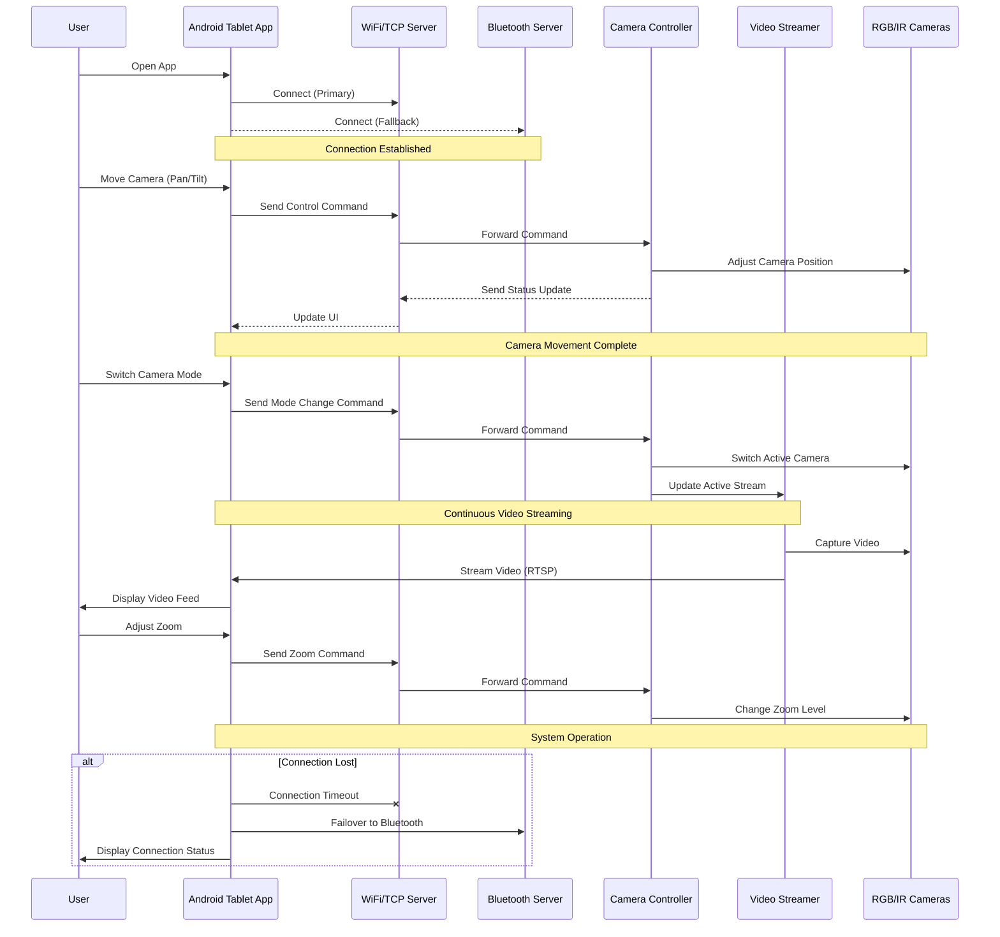

# PTZ Camera Control System: Communication Flow

This sequence diagram illustrates the typical communication flow between the Android tablet application and the onboard computer components during normal operation of the PTZ Camera Control system.

## Key Communication Sequences

The diagram shows:
1. **Connection Establishment**: Initial connection via WiFi (primary) or Bluetooth (fallback)
2. **Camera Movement Control**: How pan/tilt commands flow through the system
3. **Camera Mode Switching**: Process for switching between RGB and IR/Thermal cameras
4. **Video Streaming**: Continuous video feed from cameras to the Android app
5. **Failover Handling**: Automatic switching to Bluetooth if WiFi connection is lost

## Sequence Diagram

