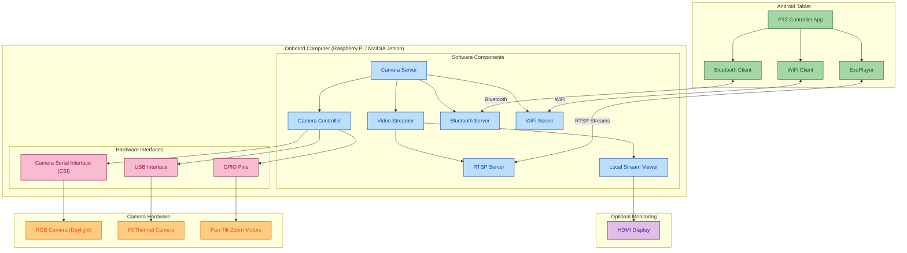

# PTZ Camera Controller: Deployment Architecture

This document illustrates the deployment architecture of the PTZ Camera Controller system, showing how components are distributed across devices and how they connect in a physical implementation.

## Deployment Diagram

## Deployment Components Description

### Android Tablet
- **PTZ Controller App**: Main Android application providing the user interface
- **ExoPlayer**: Media playback component that handles video streaming display
- **Bluetooth Client**: Handles Bluetooth connectivity to the onboard computer
- **WiFi Client**: Manages WiFi TCP/HTTP communication with the onboard computer

### Onboard Computer
- **Camera Server**: Main Python application coordinating all server-side components
- **Camera Controller**: Controls camera movements and mode switching
- **Video Streamer**: Manages video encoding and streaming
- **Bluetooth Server**: Provides Bluetooth communication interface
- **WiFi Server**: Provides HTTP/TCP communication interface
- **RTSP Server**: Streams video via RTSP protocol
- **Local Stream Viewer**: Optional component for displaying video on connected monitor

### Camera Hardware
- **RGB Camera**: Standard daylight camera (connected via CSI or USB)
- **IR/Thermal Camera**: Night vision or thermal camera (typically USB connected)
- **PTZ Motors**: Motors for pan, tilt, and zoom movements (controlled via GPIO)

### Optional Components
- **HDMI Display**: Monitor connected to the onboard computer for local viewing

## Connection Types
- **Bluetooth**: Used for control commands when WiFi is unavailable
- **WiFi**: Primary connection for control commands and status updates
- **RTSP**: Video streaming protocol for transmitting camera feeds
- **HDMI**: Direct video output to connected monitor
- **GPIO**: Digital control signals for motors and sensors
- **CSI/USB**: Camera connection interfaces

## Deployment Considerations
1. The onboard computer needs to be mounted securely with the cameras
2. Power consumption should be considered, especially for battery operation
3. WiFi signal strength may affect video streaming quality
4. Local viewing is optional and only needed for debugging or setup
5. GPIO pin configuration will vary based on the specific onboard computer model