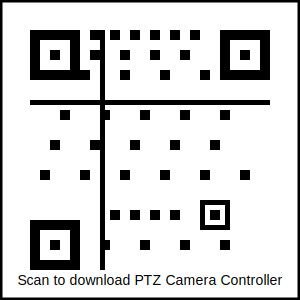

# PTZ Camera Controller

An advanced Android tablet application for controlling PTZ cameras connected to a Raspberry Pi or NVIDIA Jetson.

## Quick Installation

Scan this QR code with your Android tablet to download the app:

## Features

- **Dual-mode video streaming** - Support for both RGB and IR/Thermal cameras
- **Flexible connectivity** - Connect via WiFi or Bluetooth
- **Intuitive controls** - Simple pan, tilt, and zoom controls with touch interface
- **Camera mode switching** - Easily switch between RGB and IR/Thermal modes
- **Adaptive quality** - Adjust video quality based on network conditions
- **Preset positions** - Save and load camera position presets
- **Local monitoring** - Optional local video monitoring on the connected display

## Documentation

- [Installation Guide](installation_guide.md)
- [User Manual](user_manual.md)
- [FAQ](faq.md)

## System Requirements

### Android Tablet
- Android 6.0 (Marshmallow) or higher
- 2GB RAM (minimum)
- Bluetooth 4.0+ and/or WiFi capability

### Onboard Computer
- Raspberry Pi 3/4 or NVIDIA Jetson Nano/Xavier NX
- Python 3.6 or higher
- USB or CSI camera for RGB video
- FLIR or similar camera for thermal imaging (optional)
- Network connectivity (WiFi or Ethernet)

## For Developers

- [GitHub Release Guide](github_release_guide.md)
- [Keystore Setup Guide](keystore_setup_guide.md)

## Support

If you encounter any issues or have questions, please [open an issue](https://github.com/zforce0/ptz-camera-controller/issues) on GitHub.