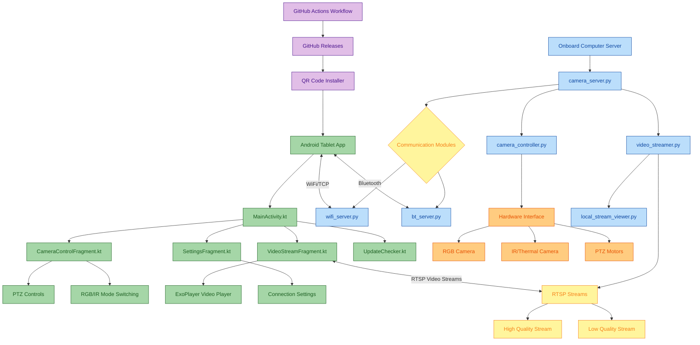

# PTZ Camera Controller System Architecture

This document provides a comprehensive view of the PTZ Camera Controller system architecture, showing how components interact across both the Android tablet application and the onboard computer server.

## System Overview

The PTZ Camera Controller system consists of two main parts:
1. **Android Tablet Application**: User interface for controlling cameras and viewing video streams
2. **Onboard Computer Server**: Backend software running on Raspberry Pi or NVIDIA Jetson that interfaces with the cameras

The system supports dual communication methods (WiFi and Bluetooth) for flexibility and redundancy, and handles multiple camera types (RGB and IR/Thermal).

## Architecture Diagram

## Component Descriptions

### Android Tablet Application

| Component | Description |
|-----------|-------------|
| **MainActivity.kt** | Main entry point for the Android app, handles navigation between fragments and overall app lifecycle. |
| **CameraControlFragment.kt** | User interface for controlling pan, tilt, and zoom functions of the camera. |
| **VideoStreamFragment.kt** | Displays the video stream from the active camera (RGB or IR/Thermal). |
| **SettingsFragment.kt** | Configuration interface for connection settings, stream quality, and app preferences. |
| **UpdateChecker.kt** | Checks for app updates from GitHub releases and notifies users. |
| **ExoPlayer** | Android media player used to display RTSP video streams. |

### Onboard Computer Server

| Component | Description |
|-----------|-------------|
| **camera_server.py** | Main server application that initializes and manages all server-side components. |
| **camera_controller.py** | Interfaces with the physical cameras, handling pan, tilt, zoom operations and mode switching between RGB and IR. |
| **video_streamer.py** | Manages video streaming from cameras to the Android tablet via RTSP protocol. |
| **wifi_server.py** | Handles HTTP/TCP communication with the Android app for commands and status updates. |
| **bt_server.py** | Provides Bluetooth communication capability as an alternative to WiFi. |
| **local_stream_viewer.py** | Optional module for viewing camera streams directly on the onboard computer when a monitor is connected. |

### Hardware Interface

| Component | Description |
|-----------|-------------|
| **RGB Camera** | Daylight camera for normal operation. |
| **IR/Thermal Camera** | Night vision or thermal camera for low-light or heat detection scenarios. |
| **PTZ Motors** | Motors controlling the physical pan, tilt, and zoom movements of the camera system. |

### Deployment & Distribution

| Component | Description |
|-----------|-------------|
| **GitHub Actions Workflow** | Automated CI/CD pipeline for building the Android APK when new versions are tagged. |
| **GitHub Releases** | Hosts the compiled APK files and release information. |
| **QR Code Installer** | Generated QR codes that simplify installation on Android tablets. |

## Communication Flows

1. **Control Commands**: Android app → WiFi/Bluetooth → Onboard server → Camera controller → PTZ motors
2. **Video Feed**: Cameras → Video streamer → RTSP streams → Android app display
3. **Status Updates**: Camera controller → Communication modules → Android app

For a detailed sequence diagram of the communication flow, see the [Communication Flow Documentation](communication_flow.md).

For information on how the system components are deployed across physical devices, see the [Deployment Architecture Documentation](deployment_architecture.md).